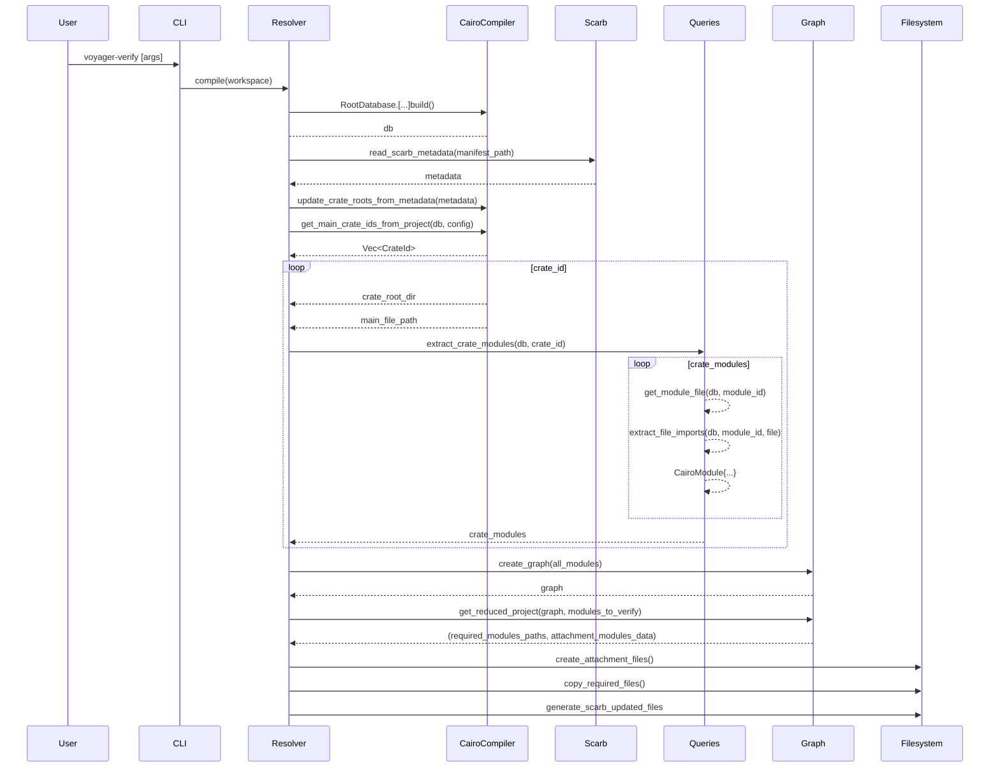

# voyager-resolver

## Install Rust

```bash
curl https://sh.rustup.rs -sSf | sh -s
```

## Build cairo project

```bash
cargo run --bin voyager-resolver verify-project examples/cairo_ds
```

## Documentation

### Overview

Cairo 1 adopts a crate/module-centric approach, inspired by Rust's design, to group related items into coherent units, facilitating the organization of code within a project. To declare the root of a crate, Cairo uses a `lib.cairo` file, which attaches all the modules to the module tree, making them accessible to the rest of the project.

The challenge in designing this contract verifier is that, to verify a contract within a project, we need to provide the compiler with the entire project, as it must resolve all the modules declared in the `lib.cairo` file and their submodules. However, to improve performance, we want to minimize the number of files sent to our backend.

To verify a contract, we only need to send the contract itself and its dependent modules. However, the compiler requires a valid Cairo project to compile. Therefore, we must send a Cairo crate, with a `lib.cairo` file that declares all the modules on which the contract depends, including their submodules. To accomplish this, we follow these steps:

- Gather the list of imports used by each module in the crate.
- Resolve the file path of each module, ignoring virtual file modules generated by compiler plugins.
- Create a directed graph that links module files together based on their dependencies.
- Generate a new crate that includes only the required files.
- Generate the "attachment" files that link the modules to the module tree up to the top-level lib.rs file.

As an example, let's consider the following project structure:

```
.
├── cairo_ds
│   ├── Scarb.toml
│   └── src
│       ├── contracts
│       │   └── erc20.cairo
│       ├── contracts.cairo
│       ├── lib.cairo
│       ├── tests
│       │   └── test_erc20.cairo
│       └── tests.cairo
└── dependency
    ├── Scarb.toml
    └── src
        ├── lib.cairo
        └── main.cairo

```

To verify the erc20.cairo contract that imports `use dependency::main::foo;`, we generate a new crate that contains only the required files.
In this case, our contract depends on the external `dependency dependency::main::foo`. The resolver generates two crates: one for the cairo_ds project and one for the dependency project. Both crates contain only the necessary files.

### Output

Here is the generated minimal `cairo_ds` crate that can be sent to our backend for verification:

```
.
├── cairo_ds
│   ├── Scarb.toml
│   └── src
│       ├── contracts
│       │   └── ERC20.cairo
│       ├── contracts.cairo
│       └── lib.cairo
└── dependency
    ├── Scarb.toml
    └── src
        ├── lib.cairo
        └── main.cairo
```

You will notice here that everything related to `tests` is gone, as it is not required to compile the `erc20.cairo` contract.

This reduced project is generated under the `voyager-verify` directory, which is created in the root of the project.

### Scarb

Our verifier will use a `tool` section inside the Scarb manifest file to know which contracts it should verify.
Users will create a section `tool.voyager`, under which they will declare the name of the contracts they want
to verify, followed by the path to the contract file and the address the associated on-chain address.

```toml
[tool.voyager]
ERC20 ={path= "contracts/ERC20.cairo", address = "0x12345"}
```

### Sequence Diagram


